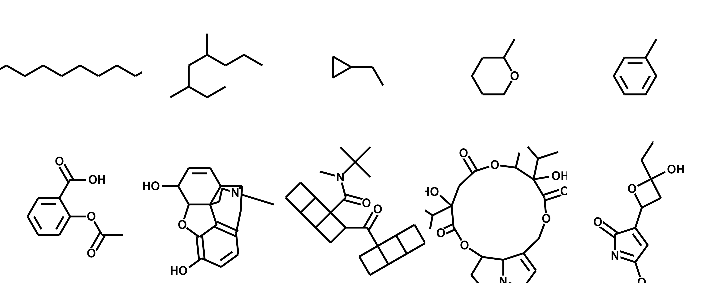

# ChemDraw

---


Use plotly to draw molecules.
The code is highly configurable to get the exact look you want!


(Development still in progress. So there are some bugs. But its working pretty well so far!)

---

## Installation

Pip installable package available.

`pip install chemdraw`


---
---

## Dependencies

* [numpy](https://github.com/numpy/numpy) (1.23.1)
  * Used for math
* [plotly](https://github.com/plotly/plotly.py) (5.9.0)
  * Plots molecules
* [kaleido](https://github.com/plotly/Kaleido)  (0.1.0post1)
  * Converts plotly graphs to images (png, svg, etc.)
  * I am not using the most recent version of kaleido as it does not play nice with my computer. Try the newest 
	version, but if you are having issues install this specific version. 
* [rdkit](https://github.com/rdkit/rdkit) (2022.3.4)
  * Convert SMILES to position coordinates.
* [Pillow](https://github.com/python-pillow/Pillow) (9.2.0)
  * Used for image manipulation.
  

---
---

# Examples:

```python
import chemdraw

mol = "O=C(C)Oc1ccccc1C(=O)O"
mod_drawer = chemdraw.Drawer(mol, title=mol)
fig = mod_drawer.draw()
fig.show()
```
(Image may be distorted from viewer, but real image is not.)


---

```python
import chemdraw

molecules = [
    "CCCCCCCCCC",
    "CC(CC(CCC)C)CC",
    "CCC1CC1",
    "O1CCCCC1C",
    "C1=CC=CC=C1C",
    "O=C(C)Oc1ccccc1C(=O)O",
    "CN1CCC23C4C1CC5=C2C(=C(C=C5)O)OC3C(C=C4)O",
    "CC(C)(C)N(C)C(=O)C14C3C2C1C5C2C3C45C(=O)C69C8C7C6C%10C7C8C9%10",
    "CC3C(C(=O)OCC1=CCN2C1C(CC2)OC(=O)C(CC(=O)O3)(C(C)C)O)(C(C)C)O",
    "CCCC1(CC(O1)C2=CC(=NC2=O)OC)O"
]

drawer = chemdraw.GridDrawer(molecules)
drawer.draw_png("example_2")
```
(Image may be distorted from viewer, but real image is not.)

