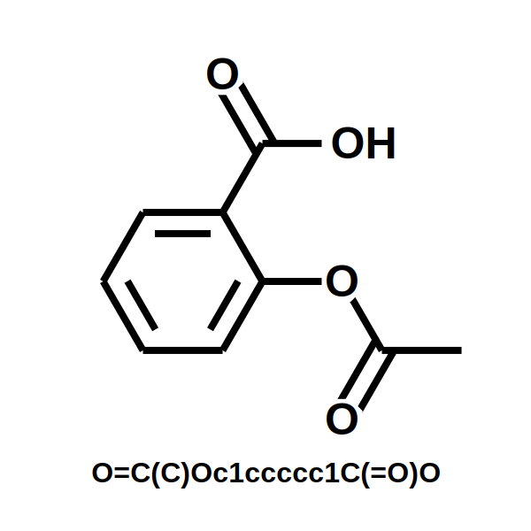

# ChemDraw
Draw molecules!


## Installation

Pip installable package available.

`pip install chemdraw`


---

---

## Dependencies

* numpy (1.23.1)
  * Used for math
* plotly==5.9.0
  * Plots molecules
* kaleido==0.1.0post1
  * Converts plotly graphs to images (png, svg, etc.)
  * I am not using the most recent version of kaleido as it does not play nice with my computer. Try the newest 
	version, but if you are having issues install this specific version. 
* rdkit==2022.3.4
  * Convert SMILES to position coordinates.
* Pillow==9.2.0
  * Used for image manipulation.
  
# Examples:

```python
    import chemdraw

    mol = "O=C(C)Oc1ccccc1C(=O)O"
    mod_drawer = chemdraw.Drawer(mol, title=mol)
    fig = mod_drawer.draw()
    fig.show()
```
**Image may be distorted from viewer, but real image is not.**




