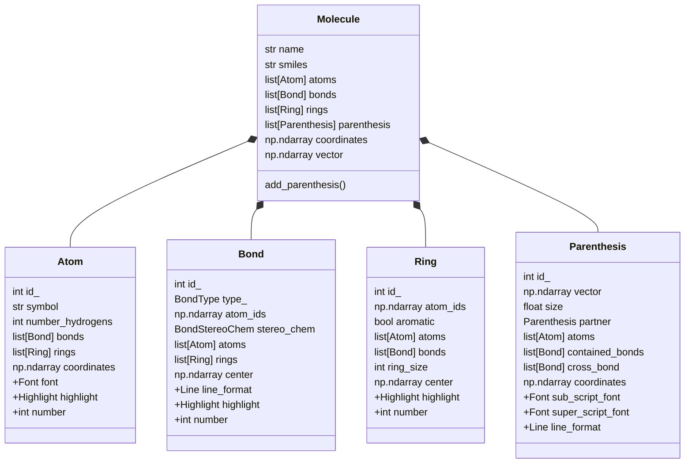
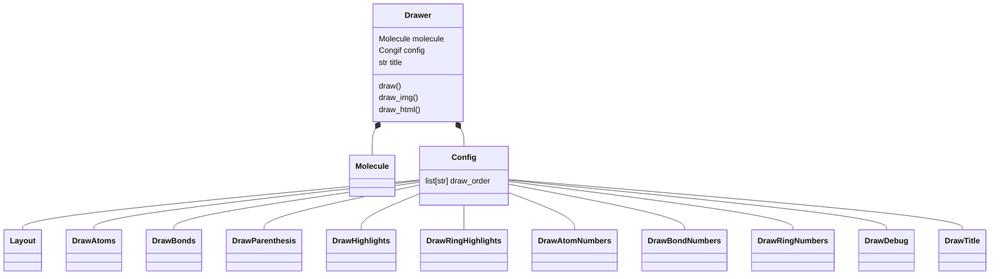

# Introduction

The code is spilt into two chunks: 'chemistry objects' and 'drawer'. The chemistry objects capture all the 
details to create, store, and organize all information about the respective objects.
The Drawer objects then use the chemistry objects to draw the objects.

Global formatting is done through the `drawer.config`.

Local formatting is done through the chemistry objects.

---

## Chemistry Objects

"+" is for drawing only

---
## Drawer

